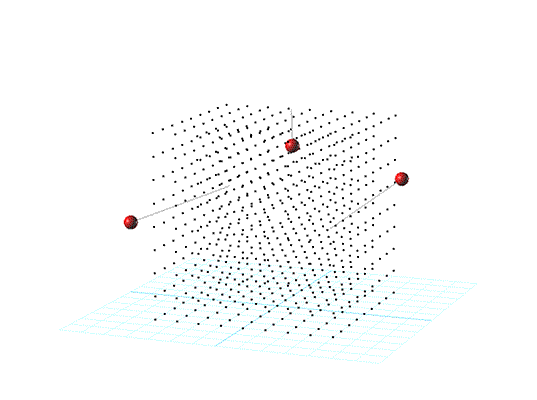

# 3D Modeling Reimagined 
Next generation 3D Modeling Application

3D modeling reduces to 5 tools, one of which is Bend. Instead of the mess of points required for NURBS, TSplines, SubDs and the rest -a new approach to modeling curvature. To most easily articulate form, don't bother with objects themselves, but the space in which they sit. Model only the peaks of features of any free-form object, and have the rest seamlessly transition between those peaks.

1. Bend: Articulate form (described above).
2. Intersect: Generate mapped tables of junctions and segments.
3. Trail: Object, higher by a dimension, expressing movement of other object.
4. Parallel/perpendicular: Find location on object relative to other object.
5. Radius: Find radius point tangent to point on curve.

Utilities to help things along:

- Material: Visualization/appearance of 3D objects. (Reflection, Refraction, roughness, project to surface, color...)
- Fluids: Simulate liquid, smoke, flame...
- Sound: Create and manipulate sound. Sound can be expressed by just an oscillating, moving point in space.
- Input: Receive parameters from the likes of a keyboard, mouse, touch-pad, stock-ticker...
- Logic: Logic reduces to *if, then, goto*. Define and layer packets of logic. Give commands synonyms so the AI you're essentially configuring has better intuition and needs less rigorously worded input.
- Networks: Assign different access to different groups of users.

*See PDFs for details. I’m new to software development and could use directions. If you see a need for this interface I would love to hear from you.*
